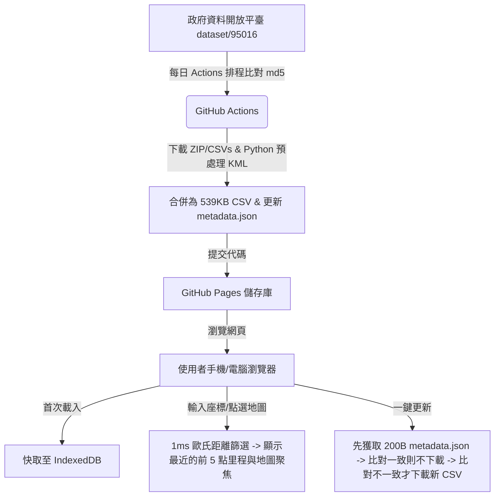

# 國道百公尺里程查詢系統

本專案是一個專為手機與電腦設計的**國道百公尺里程定位與地圖查詢系統**。
資料來源對接交通部高速公路局之「高速公路里程樁」開放資料（資料集識別碼：95016）。

本專案採用 **Serverless 靜態網頁架構**，結合 **GitHub Actions** 與 **瀏覽器 IndexedDB 本地資料庫快取技術**。透過在 GitHub 端預處理 KML 檔案，將原廠 5MB 資料包壓縮為僅 **539 KB** 的精簡版 CSV，並透過 Leaflet Canvas 畫布渲染與 1ms 歐氏距離最近鄰演算法，解決了海量地理標記在手機端開啟或拖曳地圖時的卡頓問題。

---

## 🎨 設計概念 (Design Concepts)

本系統的核心設計是「**高渲染效能、輕量網路傳輸、一鍵定位導航**」。



### 1. 解決海量標記的地圖渲染延遲 (Map Lag)
10,088 個里程點若全部以 DOM 節點 (Marker) 加入地圖，會導致手機瀏覽器在平移與縮放時產生嚴重卡頓甚至閃退。
- **Canvas 畫布渲染**：系統指定 Leaflet 使用 Canvas 渲染器 (`L.canvas()`)。所有里程點被繪製在單一畫布上，沒有產生額外的 DOM 元素，即使 10,000 個點全部呈現在螢幕上依然能維持 60fps 的拖拉流暢度。
- **動態視區過濾 (Viewport Filtering)**：
  - 在大範圍縮放級別（Zoom < 11）下，僅顯示國道網絡路線（折線），不渲染里程圓點，保持地圖整潔。
  - 當放大到局部地區（Zoom >= 11）時，JS 會即時計算當前地圖顯示邊框（Bounding Box）內的里程點，動態繪製在 Canvas 上，避免渲染螢幕外的無用點。

### 2. 極速最近鄰查詢 (1ms Nearest-Neighbor Search)
- **第一階段（歐氏距離平方）**：當使用者輸入座標或直接在畫面上點擊地圖時，系統使用簡單的歐幾里得距離平方比對公式（$d^2 = \Delta Lat^2 + \Delta Lng^2$）快速比對所有 10,088 點。由於此公式只包含基本的加減乘法，在瀏覽器中可在 **1 毫秒內**篩選出最近的前 5 個候選點。
- **第二階段（Haversine 距離）**：對前 5 個候選點使用 Haversine 球面距離公式計算精確的地表真實距離。
- **鄰近公路群組展示**：由於高速公路交流道或重疊路段（如系統交流道）的交會，單一座標可能會同時接近不同國道的里程樁。系統會**完整列出最鄰近的前 5 筆里程樁**（標示其所屬國道與精確距離），供使用者自行核對與選擇，大幅提升實用性。

### 3. 解套 CORS 跨域限制與極致壓縮
- 高公局原始資料為 300KB 的 ZIP 壓縮檔（解壓縮後為 5MB 的多個 KML 檔），且政府伺服器未開啟 CORS 跨來源分享，前端瀏覽器無法直接下載。
- 本系統在 **GitHub Actions 端使用 Python 進行預處理**：自動爬取資料頁面，動態獲取 md5 下載點，下載 ZIP 後將其解壓縮、解碼 CP950 亂碼檔名，並以正則表達式解析 KML 檔案中的 XML placemarks 以及額外的 CSV 線段資料。
- 最終合併為單一精簡版 CSV 檔，大小僅 **539 KB**。下載速度提升了 90%，且前端無須承擔 XML 解析的 CPU 負載。

### 4. 流量控制與一鍵更新 (Zero-Traffic Check)
- 網頁端採用本地 `IndexedDB` 進行永久快取，首次載入後，後續開啟皆為秒開。
- 當點選「更新資料」時，網頁會先發送一個 200 位元組的 `metadata.json` 請求，比對在 GitHub Actions 偵測到並提交的版本 md5。
- 若無版本變更，顯示「已是最新版」並直接終止，**絕不下載 539KB 數據**，將多餘流量降為 0，達成省電與流量節約。

---

## 📱 使用方式 (Usage Guide)

### 1. 座標定位查詢最近里程樁
- 進入「**座標查詢**」分頁。
- 提供三種方式查詢：
  - **手動輸入**：手動輸入目標緯度與經度，點擊「**開始查詢**」。
  - **GPS 偵測**：點擊「**偵測定位**」，瀏覽器會調用手機 GPS 填入目前位置座標，並自動進行最近鄰查詢。
  - **地圖點擊（最直覺）**：直接在地圖上任何位置點擊，地圖會在地圖上建立標記，並立即在左側顯示最近里程樁的清單。
- 查詢完成後，系統會在左側列出最近的 5 個里程樁與公尺距離，並自動在選取的最近里程點與您的輸入點之間**繪製黃色虛線連結**，自動縮放視野以容納兩點。
- 詳細卡片會展示該里程點的國道名稱、方向軌道（北上/南下/東向/西向等）、累計公尺數、海拔高度與經緯度。點選「**導航到此樁**」可直接打開 Google Maps App 開始導航。

### 2. 瀏覽國道路網軌跡
- 進入「**國道列表**」分頁。
- 清單列出了所有國道編號與里程範圍。
- 點選任一國道（如國道1號），地圖會高亮並自動縮放至該國道涵蓋範圍，同時顯示其所有軌跡折線。
- 地圖放大（Zoom >= 11）後，該國道的所有百公尺里程點會以綠色圓點呈現在地圖上，點選任何圓點均可查看其精確樁號與海拔高度。

---

## 🛠️ 本地開發與測試

本專案無任何前端編譯步驟（No Build Tools），只要啟動一個簡單的本地伺服器即可運作：

1. 開啟終端機並進入專案目錄：
   ```bash
   cd freeway-milestone-query
   ```
2. 啟動 Python 內建輕量伺服器（使用 8081 端口以避免與省道專案衝突）：
   ```bash
   python3 -m http.server 8081
   ```
3. 在瀏覽器打開以下網址進行測試：
   [http://localhost:8081](http://localhost:8081)

---

## 🚀 GitHub 上傳與 Pages 永久網址部署指南

請按照以下步驟將本專案發布至您的 GitHub 並啟用免費的永久網址：

### 第一步：在 GitHub 上建立新儲存庫 (Repository)
1. 登入您的 [GitHub 帳號](https://github.com/)。
2. 點擊右上角 `+` -> **New repository**。
3. 設定 Repository name 為：`freeway-milestone-query`。
4. 設為 **Public**（公開），且**不要**勾選 "Initialize this repository with a README"。
5. 點擊 **Create repository**。

### 第二步：上傳本地專案代碼
在您的本地終端機（確保在 `freeway-milestone-query` 資料夾下）執行以下指令：

```bash
# 1. 提交檔案至 Git 本地快取
git add .

# 2. 建立提交紀錄
git commit -m "feat: 實作國道百公尺里程查詢系統與 Canvas 高流暢地圖"

# 3. 強制使用 main 做為預設分支
git branch -M main

# 4. 關聯到您剛剛建立的 GitHub 儲存庫 (請將 <your-username> 換成您的 GitHub 帳號)
git remote add origin https://github.com/<your-username>/freeway-milestone-query.git

# 5. 上傳代碼
git push -u origin main
```

### 第三步：啟用 GitHub Pages (取得永久網址)
1. 在 GitHub 網頁上，進入您的 `freeway-milestone-query` 儲存庫的 **Settings**（設定）-> **Pages**。
2. 在 **Build and deployment** 下的 **Source** 選擇 `Deploy from a branch`。
3. 在 **Branch** 選項中，選擇 `main`，並將資料夾設為 `/ (root)`。
4. 點擊 **Save**。
5. 稍等約 1 分鐘，重新整理頁面，最上方會出現您的專案永久網址：
   `https://<your-username>.github.io/freeway-milestone-query/`

### 第四步：設定 GitHub Actions 自動更新權限
為了讓自動更新工作流能在每日偵測到政府資料更新時，自動將更新後的里程檔案與版本資訊提交回您的 GitHub，您需要開啟 Actions 寫入權限：
1. 依然在儲存庫的 **Settings**（設定）頁面。
2. 點選左側選單的 **Actions** -> **General**。
3. 滾動到最下方找到 **Workflow permissions**。
4. 將預設的 "Read repository contents and packages permissions" 改選為 **"Read and write permissions"**。
5. 點擊 **Save** 儲存。

> 🎉 至此已設定完畢！系統將於每日凌晨自動檢查高公局資料，若有更新便會重構里程資料並更新網頁，您只需打開您的 Pages 永久網址即可隨時使用最精準的國道百公尺里程資料！
